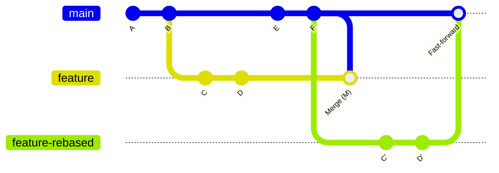

# Git Commands for Collaboration

## Table of Contents
1. [Git Branching Commands](#git-branching-commands)
   - [Creating New Branches](#creating-new-branches)
   - [Deleting Branches](#deleting-branches)
   - [Renaming Branches](#renaming-branches)
   - [Switching Branches](#switching-branches)
   - [Setting Upstream Branches](#setting-upstream-branches)

2. [Git Fetch, Merge, and Pull](#git-fetch-merge-and-pull)
   - [Git Fetch](#git-fetch)
   - [Git Merge](#git-merge)
   - [Git Pull](#git-pull)
   - [Fetch vs Pull](#fetch-vs-pull)
   - [Pull Requests](#pull-requests)
   - [Merge Conflict Scenarios](#merge-conflict-scenarios)
   - [Resolving Merge Conflicts](#resolving-merge-conflicts)
   - [Aborting a Merge](#aborting-a-merge)

3. [Advanced Git Operations](#advanced-git-operations)
   - [Git Rebase](#git-rebase)
   - [Rebase vs Merge](#rebase-vs-merge)
   - [Git Cherry-Pick](#git-cherry-pick)
   - [Git Squash](#git-squash)
   - [Git Prune](#git-prune)

4. [Resetting and Reverting](#resetting-and-reverting)
   - [Git Reset](#git-reset)
   - [Git Reflog](#git-reflog)
   - [Checkout vs Revert vs Reset](#checkout-vs-revert-vs-reset)
   - [Git Stash](#git-stash)
   - [Managing Multiple Stashes](#managing-multiple-stashes)
   - [Stashing into a Branch](#stashing-into-a-branch)

5. [General Git Commands](#general-git-commands)
   - [Git Config](#git-config)
   - [Git Remote](#git-remote)
   - [Git Log](#git-log)
   - [Git Tag](#git-tag)
   - [Git Rev-List](#git-rev-list)
   - [Git Rev-Parse](#git-rev-parse)
   
6. [Conventional Commits](#conventional-commits)
   - [Commit Message Structure](#commit-message-structure)
   - [Types of Commits](#types-of-commits)
   - [Scopes](#scopes)
   - [Breaking Changes](#breaking-changes)
   - [Examples](#examples)
   - [Tools for Conventional Commits](#tools-for-conventional-commits)
   - [Benefits of Structured Commits](#benefits-of-structured-commits)

7. [Additional Useful Commands](#additional-useful-commands)


## Git Branching Commands

### Creating New Branches

The ability to create branches is one of Git's most powerful features. Branches allow you to work on different features or fixes simultaneously without affecting the main codebase.

**Basic Command:** 
```bash
git branch <branch-name>
```

This creates a new branch but doesn't switch to it.

**Create and Switch in One Command:**
```bash
git checkout -b <branch-name>
```

Or with the newer syntax:
```bash
git switch -c <branch-name>
```

**Creating a Branch from a Specific Commit:**
```bash
git branch <branch-name> <commit-hash>
```

**Use Case:** When developing a new feature, fixing a bug, or experimenting with code changes without affecting the main codebase.

### Deleting Branches

Once a branch's changes have been merged or if the branch is no longer needed, you can delete it to keep your repository clean.

**Deleting a Local Branch:**
```bash
git branch -d <branch-name>  # Safe delete (won't delete if contains unmerged changes)
git branch -D <branch-name>  # Force delete (will delete even if contains unmerged changes)
```

**Deleting a Remote Branch:**
```bash
git push origin --delete <branch-name>
# or
git push origin :<branch-name>
```

**Use Case:** Cleaning up after merging a feature branch or abandoning work on a particular branch.

### Renaming Branches

Sometimes you might want to rename a branch to better reflect its purpose.

**Renaming a Local Branch:**
1. If you're on the branch you want to rename:
   ```bash
   git branch -m <new-name>
   ```

2. If you're on a different branch:
   ```bash
   git branch -m <old-name> <new-name>
   ```

**Renaming a Remote Branch:**
1. Rename the local branch
2. Delete the old remote branch
3. Push the new branch to remote

```bash
git branch -m <old-name> <new-name>       # Rename locally
git push origin --delete <old-name>        # Delete old remote branch
git push origin -u <new-name>              # Push new branch and set upstream
```

**Use Case:** When a branch's purpose has evolved or when fixing a naming mistake.

### Switching Branches

Moving between branches is a common operation when working on different aspects of a project.

**Using checkout (traditional):**
```bash
git checkout <branch-name>
```

**Using switch (newer, clearer syntax):**
```bash
git switch <branch-name>
```

**Create and switch to a new branch:**
```bash
git switch -c <new-branch>
```

**Use Case:** Moving between different features or bug fixes you're working on.

### Setting Upstream Branches

Setting an upstream connection links your local branch to a remote branch, making push and pull operations simpler.

**When pushing a new branch:**
```bash
git push -u origin <branch-name>
# or
git push --set-upstream origin <branch-name>
```

**Setting upstream for an existing branch:**
```bash
git branch --set-upstream-to=origin/<branch-name> <branch-name>
# or shorter
git branch -u origin/<branch-name>
```

**Checking current upstream configuration:**
```bash
git branch -vv
```

**Use Case:** Establishing a tracking relationship between local and remote branches to simplify future push and pull commands.

## Git Fetch, Merge, and Pull

### Git Fetch

Fetch retrieves changes from a remote repository without integrating them into your local branches.

**Basic fetch from origin:**
```bash
git fetch origin
```

**Fetch a specific branch:**
```bash
git fetch origin <branch-name>
```

**Fetch all branches from all remotes:**
```bash
git fetch --all
```

**Fetch and prune deleted remote branches:**
```bash
git fetch --prune
```

**Use Case:** Downloading remote changes to examine them before deciding whether to merge or when you want to see what others have been working on.

### Git Merge

Merge integrates changes from one branch into another.

**Merging a branch into your current branch:**
```bash
git merge <branch-name>
```

**Merge with a commit message:**
```bash
git merge <branch-name> -m "Merge message"
```

**Fast-forward merge when possible:**
```bash
git merge --ff-only <branch-name>
```

**No fast-forward (creates a merge commit):**
```bash
git merge --no-ff <branch-name>
```

**Use Case:** Combining completed features back into the main branch or incorporating bugfixes.

### Git Pull

Pull is effectively a `git fetch` followed by a `git merge` - it retrieves changes and integrates them in one step.

**Basic pull from tracking branch:**
```bash
git pull
```

**Pull from specific remote and branch:**
```bash
git pull origin <branch-name>
```

**Pull with rebase instead of merge:**
```bash
git pull --rebase
```

**Use Case:** Updating your local branch with the latest changes from the remote repository.

### Fetch vs Pull

Understanding the difference between fetch and pull is crucial for effective collaboration.

| Git Fetch | Git Pull |
|-----------|----------|
| Downloads remote changes but doesn't integrate them | Downloads remote changes and immediately integrates them |
| Doesn't modify your working directory | Updates your working directory |
| Safer operation as it doesn't create automatic merges | Can cause unexpected merge conflicts |
| Requires explicit merge/rebase after reviewing changes | Combines fetch and merge/rebase in one step |
| Good for checking remote changes before integration | Convenient for quickly updating your branch |

**Use Case:** Use fetch when you want to see changes before integrating them; use pull when you're confident about integrating the latest remote changes.

### Pull Requests

Pull Requests (PRs) are not a core Git feature but a collaboration feature provided by platforms like GitHub, GitLab, and Bitbucket.

**What is a Pull Request?**
A pull request is a way to propose changes from a branch (usually in a forked repository) to be merged into another branch (typically in the original repository).

**Typical Pull Request Workflow:**
1. Fork a repository (on platforms like GitHub)
2. Create a branch for your feature/fix
3. Make your changes and commit them
4. Push your branch to your fork
5. Open a pull request through the platform's interface
6. Discuss and review the changes
7. Make additional changes if requested
8. Maintainer merges the pull request

**Key Components of Pull Requests:**
- Title and description of changes
- Comparison view of changes
- Discussion threads
- Code review functionality
- CI/CD integration for automated testing
- Merge options (merge commit, squash, rebase)

**Use Case:** Proposing changes to a project in a structured way that allows for code review and discussion before integration.

### Merge Conflict Scenarios

Merge conflicts occur when Git cannot automatically reconcile differences between branches. Here are common scenarios:

1. **Line-level conflicts:** Two branches modify the same line of a file in different ways.

2. **File addition conflicts:** Both branches add a file with the same name but different content.

3. **File deletion conflicts:** One branch modifies a file while another deletes it.

4. **File mode conflicts:** Branches change file permissions differently.

5. **Rename conflicts:** One branch renames a file while another modifies it.

6. **Binary file conflicts:** Both branches modify a binary file (like an image).

7. **Whitespace conflicts:** Changes to whitespace in the same area of code.

8. **Branch divergence:** Branches have diverged significantly, making automatic merging difficult.

9. **Rebase conflicts:** Similar to merge conflicts but occur during rebasing.

10. **Cherry-pick conflicts:** When cherry-picking commits that modify the same code as changes in your current branch.

**Use Case Understanding:** Recognizing common conflict scenarios helps in planning work to minimize conflicts and in developing strategies to resolve them when they occur.

### Resolving Merge Conflicts

When Git can't automatically merge changes, you'll need to resolve conflicts manually.

**Steps to Resolve Merge Conflicts:**

1. **Identify Conflicted Files:**
   ```bash
   git status
   ```

2. **Open Conflicted Files:**
   Look for conflict markers in the files:
   ```
   <<<<<<< HEAD
   Your changes
   =======
   Their changes
   >>>>>>> branch-name
   ```

3. **Edit the Files:**
   Modify the files to resolve the conflicts by:
   - Keeping your changes
   - Keeping their changes
   - Combining both changes
   - Creating an entirely new solution

4. **Mark as Resolved:**
   ```bash
   git add <resolved-file>
   ```

5. **Continue the Process:**
   For merge:
   ```bash
   git merge --continue
   ```
   
   For rebase:
   ```bash
   git rebase --continue
   ```

6. **Complete the Merge:**
   ```bash
   git commit
   ```
   (Git will provide a default merge commit message)

**Tools for Conflict Resolution:**
- Visual editors with Git integration (VS Code, IntelliJ)
- Dedicated merge tools (KDiff3, Meld)
- Using `git mergetool` to launch configured visual diff tool

**Use Case:** Resolving conflicts that arise when integrating changes from multiple developers working on the same codebase.

### Aborting a Merge

Sometimes you may want to cancel a merge operation, especially if conflicts are too complex to resolve immediately.

**Abort an in-progress merge:**
```bash
git merge --abort
```

**Abort a rebase:**
```bash
git rebase --abort
```

**Abort a cherry-pick:**
```bash
git cherry-pick --abort
```

**Use Case:** When you encounter unexpected conflicts or realize that a merge should be approached differently.

## Advanced Git Operations

### Git Rebase

Rebasing is a powerful way to integrate changes from one branch into another by moving or combining commits.

**Basic rebase:**
```bash
git checkout feature-branch
git rebase main
```

**Interactive rebase (for editing, squashing, or reordering commits):**
```bash
git rebase -i HEAD~3  # Interactive rebase for the last 3 commits
```

**Continue after resolving conflicts:**
```bash
git rebase --continue
```

**Abort a rebase:**
```bash
git rebase --abort
```

**Use Case:** Creating a cleaner project history by incorporating changes from the main branch into a feature branch without creating merge commits.

### Rebase vs Merge

Choosing between rebase and merge depends on your preferred workflow and history structure.



| Aspect | Merge | Rebase |
|--------|-------|--------|
| History Structure | Preserves the original branch history with a merge commit | Rewrites history by relocating your branch to the tip of the target branch |
| Traceability | Better maintains the context of when changes were made | Creates a linear history that may obscure when changes were originally made |
| Conflict Resolution | Conflicts are resolved in a single merge commit | Conflicts might need to be resolved for each commit being rebased |
| Collaboration | Safer for shared branches since it doesn't rewrite history | Can cause issues when used on shared branches |
| Resulting History | Can create a "messy" history with many merge commits | Results in a cleaner, linear history |

**Use Case Guidance:**
- Use merge for integrating feature branches into main branches, particularly for shared branches
- Use rebase for keeping feature branches up-to-date with the main branch before merging
- Consider team preferences and repository policies

### Git Cherry-Pick

Cherry-pick allows you to select specific commits from one branch and apply them to another.

**Basic cherry-pick:**
```bash
git cherry-pick <commit-hash>
```

**Cherry-pick multiple commits:**
```bash
git cherry-pick <commit-hash-1> <commit-hash-2>
```

**Cherry-pick a range of commits:**
```bash
git cherry-pick <start-commit>..<end-commit>
```

**Cherry-pick without committing:**
```bash
git cherry-pick --no-commit <commit-hash>
```

**Use Case:** Selectively applying specific bug fixes or features from one branch to another without merging the entire branch.

### Git Squash

Squashing combines multiple commits into a single commit, which can be done during rebasing or merging.

**Squashing during interactive rebase:**
```bash
git rebase -i HEAD~3  # To squash the last 3 commits
```
Then mark commits with "squash" or "s" in the interactive editor.

**Squashing during merge:**
```bash
git merge --squash <branch-name>
```
Then commit the changes with a new message:
```bash
git commit -m "Squashed changes from feature branch"
```

**Use Case:** Cleaning up a series of "work in progress" commits before merging a feature branch, resulting in a more concise and logical history.

### Git Prune

Prune removes references to objects that are no longer in the remote repository, helping keep your repository clean.

**Prune with fetch:**
```bash
git fetch --prune
```

**Prune directly:**
```bash
git remote prune origin
```

**Pruning unreachable objects:**
```bash
git gc --prune=now
```

**Use Case:** Cleaning up references to deleted remote branches and optimizing repository storage.

## Resetting and Reverting

### Git Reset

Reset allows you to move the current branch pointer to a different commit, effectively undoing changes.

**Soft reset (keeps changes staged):**
```bash
git reset --soft HEAD~1  # Undo the last commit but keep changes staged
```

**Mixed reset (default, keeps changes unstaged):**
```bash
git reset HEAD~1  # Undo the last commit and unstage changes
```

**Hard reset (discards changes):**
```bash
git reset --hard HEAD~1  # Undo the last commit and discard changes
```

**Reset a specific file:**
```bash
git reset HEAD <file-path>  # Unstage a file
```

**Use Case:** Undoing recent commits, particularly in local development branches before pushing changes.

### Git Reflog

Reflog (reference log) records when branch tips and other references were updated in the local repository, providing a safety net for recovering lost commits.

**View the reflog:**
```bash
git reflog
```

**View reflog for a specific branch:**
```bash
git reflog show <branch-name>
```

**Recover a lost commit using reflog:**
```bash
git checkout <reflog-entry>  # e.g., git checkout HEAD@{2}
# or create a new branch pointing to that commit
git branch recovery-branch <reflog-entry>
```

**Use Case:** Recovering commits after a hard reset, rebased branch, or other operations that might have discarded commits.

### Checkout vs Revert vs Reset

Understanding the differences between these three operations is crucial for safely managing your Git history.

| Command | Effect on History | Effect on Working Directory | Typical Use Case |
|---------|-------------------|----------------------------|------------------|
| `git checkout <commit>` | Doesn't change history, just points HEAD to specified commit | Updates working directory to match specified commit | Temporarily inspecting an older version |
| `git revert <commit>` | Creates a new commit that undoes specified commit | Updates working directory with the undo changes | Safely undoing a commit that has been pushed to shared branches |
| `git reset <commit>` | Moves the branch pointer to specified commit | Depends on mode (--soft, --mixed, --hard) | Undoing local, unpublished commits |

**Comparison of Reset Modes:**
- `--soft`: Moves branch pointer, leaves changes staged
- `--mixed` (default): Moves branch pointer, unstages changes
- `--hard`: Moves branch pointer, discards changes

**Use Case Guidance:**
- Use checkout to inspect previous versions
- Use revert to undo commits that have been shared with others
- Use reset to clean up or undo local work that hasn't been shared

### Git Stash

Stash temporarily shelves changes so you can work on something else and then come back to them later.

**Basic stash operations:**
```bash
git stash                      # Stash changes
git stash save "message"       # Stash with a descriptive message
git stash list                 # List stashes
git stash apply                # Apply most recent stash (keeps the stash)
git stash pop                  # Apply most recent stash and remove it
git stash drop stash@{n}       # Remove a specific stash
git stash clear                # Remove all stashes
```

**Stashing specific files:**
```bash
git stash push -m "message" <file-path>
```

**Including untracked files:**
```bash
git stash -u
# or
git stash --include-untracked
```

**Use Case:** Temporarily setting aside uncommitted changes to switch branches, pull updates, or work on a different task.

### Managing Multiple Stashes

When working on multiple tasks, you might accumulate several stashes that need to be managed effectively.

**Creating named stashes:**
```bash
git stash save "feature X styling changes"
git stash save "bugfix for issue #123"
```

**Listing all stashes with details:**
```bash
git stash list
```

**Showing the content of a specific stash:**
```bash
git stash show stash@{1}
git stash show -p stash@{1}  # With full diff
```

**Applying a specific stash:**
```bash
git stash apply stash@{2}
```

**Creating a branch from a stash:**
```bash
git stash branch <branch-name> stash@{1}
```

**Use Case:** Managing multiple sets of changes for different tasks without committing incomplete work.

### Stashing into a Branch

Sometimes you want to create a new branch directly from stashed changes.

**Creating a branch from the most recent stash:**
```bash
git stash branch <new-branch-name>
```

**Creating a branch from a specific stash:**
```bash
git stash branch <new-branch-name> stash@{n}
```

**Use Case:** When you realize that stashed changes should be developed in a separate branch rather than the current one.

## General Git Commands

### Git Config

The config command allows you to set and get Git configuration variables that control Git's behavior.

**Viewing configurations:**
```bash
git config --list                      # List all settings
git config user.name                   # View a specific setting
git config --global --list             # List global settings
```

**Setting configurations:**
```bash
git config user.name "Your Name"       # Set local repository setting
git config --global user.email "your.email@example.com"  # Set global setting
```

**Setting aliases for common commands:**
```bash
git config --global alias.co checkout
git config --global alias.br branch
git config --global alias.st status
```

**Configuration levels:**
- `--local` (default): Repository-specific settings (stored in `.git/config`)
- `--global`: User-specific settings (stored in `~/.gitconfig`)
- `--system`: System-wide settings (stored in `/etc/gitconfig`)

**Use Case:** Customizing Git behavior and setting up identity information for commits.

### Git Remote

The remote command manages the connections to other repositories.

**Viewing remotes:**
```bash
git remote                           # List remote names
git remote -v                        # List remotes with URLs
git remote show origin               # Show details about a remote
```

**Adding remotes:**
```bash
git remote add <name> <url>
git remote add upstream https://github.com/original/repo.git
```

**Changing remote URLs:**
```bash
git remote set-url origin https://github.com/user/repo.git
```

**Removing remotes:**
```bash
git remote remove <name>
```

**Renaming remotes:**
```bash
git remote rename <old-name> <new-name>
```

**Use Case:** Managing connections to remote repositories, particularly when working with forked repositories or multiple deployment targets.

### Git Log

Log displays commit history with various formatting options.

**Basic log:**
```bash
git log
```

**Compact log:**
```bash
git log --oneline
```

**Graphical log:**
```bash
git log --graph --oneline --all
```

**Filtering log by author:**
```bash
git log --author="Name"
```

**Filtering log by date:**
```bash
git log --since="2 weeks ago"
```

**Filtering log by content:**
```bash
git log -S"function_name"  # Search for commits that add/remove the string
git log -G"regex_pattern"  # Search for commits with changes matching the regex
```

**Showing changes in each commit:**
```bash
git log -p
```

**Customizing output format:**
```bash
git log --pretty=format:"%h - %an, %ar : %s"
```

**Use Case:** Reviewing project history, finding specific changes, or understanding the evolution of the codebase.

### Git Tag

Tags provide a way to mark specific points in history as important, typically used for release versions.

**Creating tags:**
```bash
git tag v1.0.0                       # Lightweight tag
git tag -a v1.0.0 -m "Version 1.0.0" # Annotated tag with message
```

**Creating a tag for a past commit:**
```bash
git tag -a v0.9.0 <commit-hash> -m "Version 0.9.0"
```

**Listing tags:**
```bash
git tag                              # List all tags
git tag -l "v1.8.*"                  # List tags matching a pattern
```

**Showing tag details:**
```bash
git show v1.0.0
```

**Pushing tags to remote:**
```bash
git push origin v1.0.0               # Push specific tag
git push origin --tags               # Push all tags
```

**Deleting tags:**
```bash
git tag -d v1.0.0                    # Delete local tag
git push origin --delete v1.0.0      # Delete remote tag
```

**Checking out a tag:**
```bash
git checkout v1.0.0
```

**Use Case:** Marking release points and version milestones in the project's history.

### Git Rev-List

Rev-list lists commit objects in reverse chronological order and is often used as a plumbing command for other Git features.

**Listing commits in a branch:**
```bash
git rev-list <branch-name>
```

**Counting commits:**
```bash
git rev-list --count <branch-name>
```

**Limiting output:**
```bash
git rev-list --max-count=5 <branch-name>
```

**Finding commits not in another branch:**
```bash
git rev-list <branch-name> --not <other-branch>
```

**Use Case:** Scripting and automation tasks that need to process lists of commits, or determining how many commits are ahead/behind between branches.

### Git Rev-Parse

Rev-parse is a low-level command that helps convert Git references into commit hashes and extract specific information.

**Getting the full hash of HEAD:**
```bash
git rev-parse HEAD
```

**Getting a short hash:**
```bash
git rev-parse --short HEAD
```

**Finding the top-level directory of the git repository:**
```bash
git rev-parse --show-toplevel
```

**Checking if you're in a git repository:**
```bash
git rev-parse --is-inside-work-tree
```

**Getting the branch name:**
```bash
git rev-parse --abbrev-ref HEAD
```

**Use Case:** Scripting and automation to get consistent reference to commits, branches, or repository locations.

## Conventional Commits

Conventional Commits is a specification that provides a lightweight convention on top of commit messages. It provides an easy set of rules for creating an explicit commit history, which makes it easier to write automated tools and to generate release notes.

### Commit Message Structure

```
<type>[optional scope]: <description>

[optional body]

[optional footer(s)]
```

### Types of Commits

- `feat`: A new feature for the user
- `fix`: A bug fix
- `docs`: Documentation only changes
- `style`: Changes that do not affect the meaning of the code (white-space, formatting, etc)
- `refactor`: A code change that neither fixes a bug nor adds a feature
- `perf`: A code change that improves performance
- `test`: Adding missing tests or correcting existing tests
- `build`: Changes that affect the build system or external dependencies
- `ci`: Changes to CI configuration files and scripts
- `chore`: Other changes that don't modify src or test files

### Scopes

Scopes provide additional contextual information and are placed within parentheses after the type.

Examples:
- `feat(parser): add ability to parse arrays`
- `fix(database): prevent connection timeout`

### Breaking Changes

Breaking changes should be indicated by a `!` before the colon or by adding `BREAKING CHANGE:` in the footer.

Example:
- `feat!: send an email to the customer when a product is shipped`
- `refactor(api)!: remove deprecated endpoint`

### Examples

```
feat(user-auth): add password reset functionality

Implements a secure way for users to reset their passwords through email verification.

Closes #423
```

```
fix: correct minor typos in code

See the issue for details on the typos fixed.

Fixes #142
```

```
feat!: redesign user interface

BREAKING CHANGE: The previous layout components are not compatible with the new design system.
```

### Tools for Conventional Commits

- **Commitlint**: Lint commit messages
- **Commitizen**: CLI wizard for formatting commits
- **Standard Version**: Automate versioning and CHANGELOG generation
- **Semantic Release**: Fully automated version management and package publishing

### Benefits of Structured Commits

- Automatically generating CHANGELOGs
- Automatically determining a semantic version bump
- Communicating the nature of changes to teammates and stakeholders
- Making it easier for people to contribute to your projects
- Triggering build and publish processes based on commit types
- Making it easier for future maintainers to understand what happened and why

## Additional Useful Commands

### Git Bisect

Bisect uses a binary search algorithm to find which commit introduced a bug.

```bash
git bisect start
git bisect bad                # Current version is bad
git bisect good v1.0.0        # Last known good version
# Git checks out a commit halfway between good and bad
# Test this commit and mark it:
git bisect good               # If this commit works
# or
git bisect bad                # If this commit has the bug
# Continue until Git identifies the first bad commit
git bisect reset              # Return to original HEAD when done
```

**Use Case:** Efficiently finding the exact commit that introduced a bug or regression.

### Git Worktree

Worktrees allow you to check out multiple branches simultaneously in separate directories.

```bash
git worktree add ../path-to-directory branch-name  # Create a new worktree
git worktree list                                  # List worktrees
git worktree remove ../path-to-directory           # Remove a worktree
```

**Use Case:** Working on multiple branches simultaneously without stashing or committing incomplete work.

### Git Clean

Clean removes untracked files from the working directory.

```bash
git clean -n                 # Dry run (show what would be removed)
git clean -f                 # Force removal of untracked files
git clean -fd                # Remove untracked files and directories
git clean -fX                # Remove only files ignored by Git
```

**Use Case:** Cleaning up build artifacts, generated files, or reverting to a clean state after experiments.

### Git Blame

Blame shows who last modified each line of a file and in which commit.

```bash
git blame <file-path>               # Show all lines with authors
git blame -L 10,20 <file-path>      # Show only lines 10-20
git blame -w <file-path>            # Ignore whitespace changes
```

**Use Case:** Determining who made specific changes and in what context to aid in understanding code or tracking down issues.

### Git Submodule

Submodules allow you to include other Git repositories within your repository.

```bash
git submodule add <repository-url> <path>           # Add a submodule
git submodule update --init --recursive             # Initialize and update all submodules
git submodule update --remote                       # Update submodules to latest remote version
```

**Use Case:** Incorporating third-party libraries or breaking a large project into manageable components while maintaining separate version control.

### Git Hook Scripts

Hooks are scripts that Git executes before or after events like commit, push, and receive.

**Common hook types:**
- `pre-commit`: Run before a commit is finalized
- `prepare-commit-msg`: Modify default commit message
- `post-commit`: Run after a commit is completed
- `pre-push`: Run before a push is executed
- `post-merge`: Run after a merge is completed

**Setting up a hook:**
1. Navigate to `.git/hooks` in your repository
2. Create or edit a file with the hook name (e.g., `pre-commit`)
3. Make it executable: `chmod +x .git/hooks/pre-commit`

**Use Case:** Enforcing coding standards, running tests before commits, automating tasks after merges, or enforcing project policies.

### Git LFS (Large File Storage)

Git LFS is an extension that replaces large files with text pointers while storing the file contents on a remote server.

```bash
git lfs install                          # Set up Git LFS
git lfs track "*.psd"                    # Track file patterns with LFS
git add .gitattributes                   # Commit tracking configuration
git lfs ls-files                         # List tracked files
```

**Use Case:** Managing large binary files like images, videos, datasets, or compiled binaries within a Git repository.